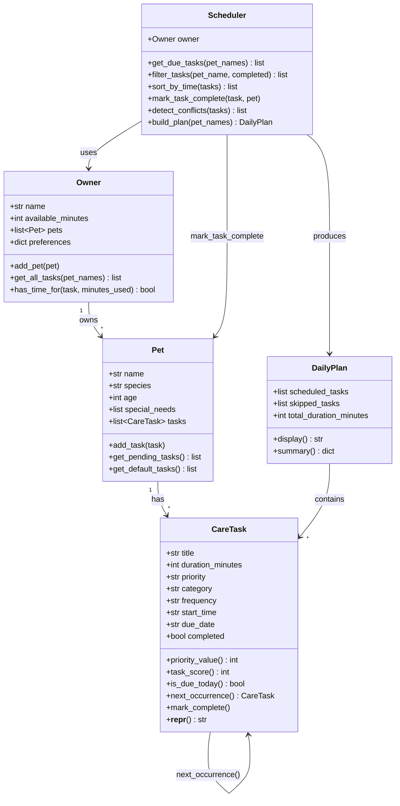

# PawPal+ UML Class Diagram

Updated to reflect the final implementation in `pawpal_system.py`.

```mermaid
classDiagram
    class CareTask {
        +str title
        +int duration_minutes
        +str priority
        +str category
        +str frequency
        +str start_time
        +str due_date
        +bool completed
        +priority_value() int
        +task_score() int
        +is_due_today() bool
        +next_occurrence() CareTask
        +mark_complete()
        +__repr__() str
    }

    class Pet {
        +str name
        +str species
        +int age
        +list special_needs
        +list~CareTask~ tasks
        +add_task(task)
        +get_pending_tasks() list
        +get_default_tasks() list
    }

    class Owner {
        +str name
        +int available_minutes
        +list~Pet~ pets
        +dict preferences
        +add_pet(pet)
        +get_all_tasks(pet_names) list
        +has_time_for(task, minutes_used) bool
    }

    class Scheduler {
        +Owner owner
        +get_due_tasks(pet_names) list
        +filter_tasks(pet_name, completed) list
        +sort_by_time(tasks) list
        +mark_task_complete(task, pet)
        +detect_conflicts(tasks) list
        +build_plan(pet_names) DailyPlan
    }

    class DailyPlan {
        +list scheduled_tasks
        +list skipped_tasks
        +int total_duration_minutes
        +display() str
        +summary() dict
    }

    Owner "1" --> "*" Pet : owns
    Pet "1" --> "*" CareTask : has
    Scheduler --> Owner : uses
    Scheduler --> Pet : mark_task_complete
    CareTask --> CareTask : next_occurrence()
    Scheduler --> DailyPlan : produces
    DailyPlan --> "*" CareTask : contains
```
